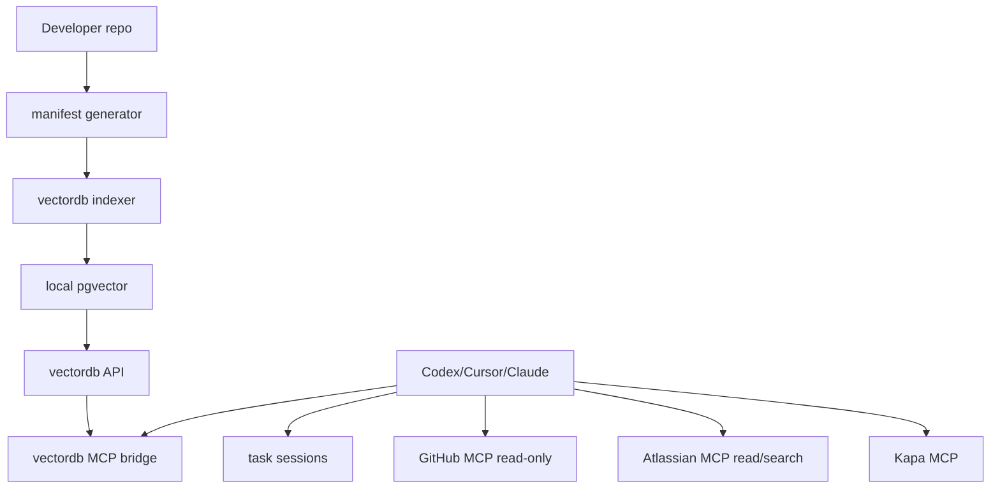

# local-tooling

Local developer AI stack for Codex, Cursor, and Claude.

It packages:

- local `pgvector` vectordb
- a FastAPI ingestion/search API
- an MCP bridge exposing `rag_health`, `rag_search`, and `rag_ingest`
- `rag_prepare_task` for a first-pass task context search
- read-only GitHub MCP wiring
- read/search Atlassian MCP wiring
- Kapa MCP wiring
- local repo bootstrap indexing, generated on each developer machine
- lightweight task sessions for context, review, and reusable learning

## Quick start

Run these commands from the `local-tooling` repository.

`--repo` must point to the working code repository the developer wants the agent
to understand and work on. It is not the path to `local-tooling`.

```bash
cp .env.example .env
# edit .env with your tokens and preferred embedding backend

./bin/local-tooling setup --agents all --repo /path/to/the/code-repo-you-work-on --bootstrap
```

Example for `gravitee-api-management`:

```bash
./bin/local-tooling setup --agents all \
  --repo /Users/madamek/work/gravitee/repos/legacy/gravitee-api-management \
  --profile gravitee-apim \
  --bootstrap
```

Then restart Codex, Cursor, or Claude if they were already running.

Ask your agent:

```text
Configure yourself using the local-tooling repo and run doctor.
```

## Common commands

```bash
./bin/local-tooling start
./bin/local-tooling stop
./bin/local-tooling doctor
./bin/local-tooling manifest --repo /path/to/the/code-repo-you-work-on --profile default
./bin/local-tooling index --repo /path/to/the/code-repo-you-work-on --profile default
./bin/local-tooling context --repo /path/to/the/code-repo-you-work-on --task "APIM-12345 ..."
./bin/local-tooling review-change --repo /path/to/the/code-repo-you-work-on
./bin/local-tooling learn --repo /path/to/the/code-repo-you-work-on --task "APIM-12345 ..." --summary-file learning.md
./bin/local-tooling install-agent-rules --repo /path/to/the/code-repo-you-work-on --agents cursor
./bin/local-tooling print-config --agent codex
```

## Upgrade

Existing users can update with the same flow as the initial setup. This keeps
the local vectordb volume and rebuilds only the service images/configuration.

```bash
cd /path/to/local-tooling
git pull

./bin/local-tooling stop
./bin/local-tooling setup --agents all --repo /path/to/the/code-repo-you-work-on --bootstrap
```

For `gravitee-api-management`:

```bash
cd /path/to/local-tooling
git pull

./bin/local-tooling stop
./bin/local-tooling setup --agents all \
  --repo /path/to/gravitee-api-management \
  --profile gravitee-apim \
  --bootstrap
```

If you want the target repo to receive/update the lightweight workflow rules
used by Cursor/Codex/Claude, run:

```bash
./bin/local-tooling install-agent-rules --repo /path/to/the/code-repo-you-work-on --agents cursor
```

Restart Codex, Cursor, or Claude after upgrading so they reload MCP config and
new tools such as `rag_prepare_task`.

Do not run `docker compose down -v` unless you intentionally want to delete the
local vectordb data.

## Bootstrap indexing

Bootstrap indexing does not transfer a database. It generates a local manifest from files the developer already has access to, then ingests those files into their local vectordb.

The `--repo` value controls what gets indexed. For example, if a developer works
on `gravitee-api-management`, `--repo` should be the absolute path to their local
checkout of `gravitee-api-management`.

The default profile indexes high-signal repo context:

- `AGENTS.md` files
- `.agent-rules/**`
- README and contributor docs
- build/package manifests
- selected docs
- selected source and test files

The `gravitee-apim` profile adds APIM-specific module rules and higher-signal Java/Angular patterns.

Generated manifests are written to `manifests/generated/`. Reports are written to `reports/`.

## Task workflow

The workflow is intentionally advisory by default. It improves context gathering
without blocking simple local development.

Start a non-trivial task with:

```bash
./bin/local-tooling context --repo /path/to/the/code-repo-you-work-on --task "APIM-12345 short task summary"
```

This queries vectordb, writes a context receipt under:

```text
<repo>/.local-tooling/sessions/<session-id>/context.json
```

When the target repo is a Git repository, `.local-tooling/` is added to its
local `.git/info/exclude` so session receipts do not pollute commits.

Before a final answer or commit, run:

```bash
./bin/local-tooling review-change --repo /path/to/the/code-repo-you-work-on
```

By default this is warning-only. Use `--strict` only when you want it to fail on
missing context, missing test changes for production edits, or missing learning.

When the task produced reusable knowledge, save it:

```bash
./bin/local-tooling learn --repo /path/to/the/code-repo-you-work-on --task "APIM-12345" --summary-file learning.md
```

If there is nothing useful to remember, record that explicitly without ingesting:

```bash
./bin/local-tooling learn --repo /path/to/the/code-repo-you-work-on --task "APIM-12345" --skip "mechanical rename, no reusable learning"
```

To make this workflow visible to agents in the target repo:

```bash
./bin/local-tooling install-agent-rules --repo /path/to/the/code-repo-you-work-on --agents cursor
```

## Safety defaults

GitHub and Atlassian are configured as read-only by default. Mutating tools such as creating PRs, editing Jira issues, adding comments, or merging PRs are disabled in generated agent config.

If you need write-capable tools, add them explicitly after reviewing `docs/security.md`.

## Requirements

- Docker with Compose v2
- Python 3.10+
- Node/npm for `npx mcp-remote`
- Network access for GitHub/Atlassian/Kapa remote tools

## Architecture


