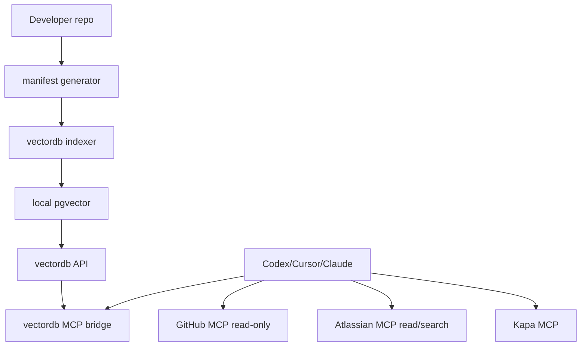

# local-tooling

Local developer AI stack for Codex, Cursor, and Claude.

It packages:

- local `pgvector` vectordb
- a FastAPI ingestion/search API
- an MCP bridge exposing `rag_health`, `rag_search`, and `rag_ingest`
- read-only GitHub MCP wiring
- read/search Atlassian MCP wiring
- Kapa MCP wiring
- local repo bootstrap indexing, generated on each developer machine

## Quick start

```bash
cp .env.example .env
# edit .env with your tokens and preferred embedding backend

./bin/local-tooling setup --agents all --repo /path/to/your/repo --bootstrap
```

Then restart Codex, Cursor, or Claude if they were already running.

Ask your agent:

```text
Configure yourself using the local-tooling repo and run doctor.
```

## Common commands

```bash
./bin/local-tooling start
./bin/local-tooling stop
./bin/local-tooling doctor
./bin/local-tooling manifest --repo /path/to/repo --profile default
./bin/local-tooling index --repo /path/to/repo --profile default
./bin/local-tooling print-config --agent codex
```

For `gravitee-api-management`, use:

```bash
./bin/local-tooling setup --agents all --repo /path/to/gravitee-api-management --profile gravitee-apim --bootstrap
```

## Bootstrap indexing

Bootstrap indexing does not transfer a database. It generates a local manifest from files the developer already has access to, then ingests those files into their local vectordb.

The default profile indexes high-signal repo context:

- `AGENTS.md` files
- `.agent-rules/**`
- README and contributor docs
- build/package manifests
- selected docs
- selected source and test files

The `gravitee-apim` profile adds APIM-specific module rules and higher-signal Java/Angular patterns.

Generated manifests are written to `manifests/generated/`. Reports are written to `reports/`.

## Safety defaults

GitHub and Atlassian are configured as read-only by default. Mutating tools such as creating PRs, editing Jira issues, adding comments, or merging PRs are disabled in generated agent config.

If you need write-capable tools, add them explicitly after reviewing `docs/security.md`.

## Requirements

- Docker with Compose v2
- Python 3.10+
- Node/npm for `npx mcp-remote`
- Network access for GitHub/Atlassian/Kapa remote tools

## Architecture


